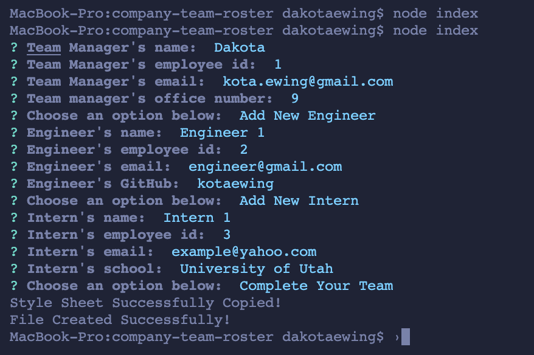

# company-team-roster

## Table of Contents
* [Description](#description)
* [Installation](#installation)
* [Usage](#usage)
* [Contributing](#contributing)
* [Tests](#tests)
* [Questions](#questions)

## Description
This is an application designed to help team leaders manage who is on their team.  With a super intuitive and easy to use user interace, this application makes team management a breeze.  Just answer a few questions in the terminal to generate the HTML and CSS files into the dist directory. Each team member will have a card created for them.  All employees will have their name, title, employee id, and emails attatched to the card.  For each job title there are also some unique identifiers.  Managers have an office number, engineers have a GitHub link to their GitHub profile, and interns have the school that they are attending.

## Installation
In order to install this app, clone the repository to your local machine by running `git clone <insert link to repository>` in the directory you wish the application to be installed on.  Then, run `npm install` in the terminal to install all of the necessary dependencies.  

## Usage
After the dependencies are installed, simply run `node index` or `node index.js` in order to begin running the application.  Prompts will pop up asking questions about each employee.  Type in your answer and press enter to submit.  When prompted to enter a new engineer, intern, or complete team use the arrow keys to navigate between each option.  When you are on the desired option, press the enter key to select it.  For the GitHub prompt on the engineers, be careful to type in the username exactly how it is.  The HTML requires that it is exact in order to find the link to GitHub.  When you are done adding team members, select 'Complete Team' in order to generate the HTML file.

## Contributing
Right now there are no contributing guidelines

## Tests
In order to make sure the objects are generating properly, run `npm run test` in the terminal and verify that all 4 testing suites pass.

## Questions
If you have any additional questions, you can reach me here:

* GitHub Account - [kotaewing](https://github.com/kotaewing)
* Email Address - kota.ewing@gmail.com
